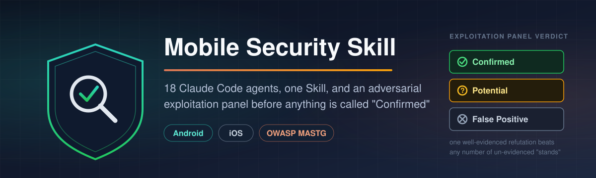

<p align="center">
  
</p>

# Mobile Security Skill

**Claude Code agents for Android & iOS mobile application security audits, OWASP MASVS/MASTG-aligned, with adversarial exploitation confirmation.**

<p align="center">
  
  
  
  
  
  
  
</p>

A complete mobile application security assessment toolkit for Claude Code: one orchestrating **Skill** and **18 specialist subagents**, grounded in an OWASP MASTG-style reference checklist, that ends in an **adversarial exploitation panel**. A prosecutor agent and independent skeptic agents have to actually try to break each other's case before anything is allowed to be reported as **Confirmed**.

It covers Android and iOS manifest/plist/entitlements, local storage and cryptography, taint analysis (source → sink → sanitizer), WebView/OAuth/OIDC/deep-links/clipboard, Android IPC and UI-layer attacks, iOS platform attacks, anti-tamper/resilience (root/jailbreak/pinning/debugger/Frida detection), network and backend API weaknesses, supply-chain and cross-platform-framework issues (Flutter, React Native, Xamarin, Unity, Cordova, KMP), and business-logic abuse.

> **This is a dual-use security tool. Read [Authorization & Legal](#authorization--legal) before running it against anything.**

**Jump to:** [Installation](#installation) · [Why the adversarial panel](#why-the-adversarial-panel) · [Agent roster](#agent-roster) · [Usage](#usage) · [FAQ](#faq) · [Authorization & Legal](#authorization--legal) · [Connect](#connect)

## Installation

### Option A: Claude Code plugin (recommended)
```bash
git clone https://github.com/harshdhamaniya/mobile-security-skill.git
```
Then in Claude Code:
```
/plugin install <path-to-cloned-repo>
```
This picks up `.claude-plugin/plugin.json` and makes the `mobile-security-skill` skill and all 18 agents available automatically. Check your Claude Code version's plugin documentation if `/plugin install` isn't available. The manual method below always works as a fallback.

### Option B: Manual copy (works on any Claude Code version)
```bash
# Clone wherever's convenient
git clone https://github.com/harshdhamaniya/mobile-security-skill.git
cd mobile-security-skill

# Copy the skill
mkdir -p ~/.claude/skills
cp -r skills/mobile-security-skill ~/.claude/skills/

# Copy the agents
mkdir -p ~/.claude/agents
cp agents/*.md ~/.claude/agents/
```
Restart Claude Code (or start a new session) so it picks up the new skill and agents. To scope this to one project instead of globally, copy into `.claude/skills/` and `.claude/agents/` inside that project's root instead of `~/.claude/`.

### Dependencies
The agents degrade gracefully, but you'll get far more out of them with these on `PATH`:
- **Android**: `apktool`, `jadx`, `aapt2`, `apksigner`, `adb`
- **iOS**: `plutil`, `codesign`, `otool`, Xcode command-line tools, `xcrun simctl`
- **Both**: `frida`/`frida-tools`, `objection`, a proxy (Burp Suite or mitmproxy)
- **Optional but valuable**: CodeQL, Semgrep, `osv-scanner`/`dependency-check`, `trufflehog`/`gitleaks`

None of these are required to start. `mobile-recon-triage` and every specialist will tell you plainly what it couldn't check because a tool was missing, rather than silently skipping it.

> **Found this useful? [Star the repo](../../stargazers).** Claude Code/Codex skill directories and plugin marketplaces commonly rank and surface by star count. A star is what makes this findable for the next person doing a mobile security audit. No signup, no cost.

## Why the adversarial panel

Static analysis, human or AI, over-reports. A grep hit for `addJavascriptInterface` or a missing `FLAG_IMMUTABLE` is a *candidate*, not a confirmed vulnerability, until someone checks whether a sanitizer elsewhere on the path already closes it, whether the attacker model is actually what it's claimed to be, and whether a platform default on the SDK version in scope already mitigates it. Most "AI finds bugs" tooling stops at the candidate stage and calls it a report.

This skill doesn't. Every finding that matters goes through `exploit-verifier-prosecutor`, which builds the strongest *honest* exploitability case it can. Then 2–3 independent `exploitability-skeptic` instances, each told explicitly to go re-read the code and genuinely try to refute the case rather than rubber-stamp it, get a turn at it. A finding only reaches **Confirmed** if the skeptics' refutation attempts fail on their own merits. See [`references/severity-rating.md`](skills/mobile-security-skill/references/severity-rating.md) for the exact decision rule, [`examples/sample-walkthrough.md`](examples/sample-walkthrough.md) for a narrated worked example, and [`examples/steps-to-reproduce.md`](examples/steps-to-reproduce.md) for a real run: actual commands, actual agent output, and the actual committed evidence files, not a narrative.

## Agent roster

| Agent | Phase | Reference doc(s) it's grounded in |
|---|---|---|
| [`mobile-recon-triage`](agents/mobile-recon-triage.md) | 1 | Builds the attack-surface map every other agent uses |
| [`android-manifest-auditor`](agents/android-manifest-auditor.md) | 2 | [`manifest-plist.md`](skills/mobile-security-skill/references/manifest-plist.md) Part A (MAN-01..21) |
| [`ios-plist-entitlements-auditor`](agents/ios-plist-entitlements-auditor.md) | 2 | [`manifest-plist.md`](skills/mobile-security-skill/references/manifest-plist.md) Part B (PLS-01..18) |
| [`storage-crypto-auditor`](agents/storage-crypto-auditor.md) | 2 | [`storage-crypto.md`](skills/mobile-security-skill/references/storage-crypto.md) (STO-*, CRY-*) |
| [`taint-flow-analyst`](agents/taint-flow-analyst.md) | 2 | [`taint-analysis.md`](skills/mobile-security-skill/references/taint-analysis.md) (TNT-01..20) |
| [`webview-security-auditor`](agents/webview-security-auditor.md) | 2 | [`clipboard-webview-oauth.md`](skills/mobile-security-skill/references/clipboard-webview-oauth.md) Part B (WEB-*) |
| [`oauth-oidc-auditor`](agents/oauth-oidc-auditor.md) | 2 | [`clipboard-webview-oauth.md`](skills/mobile-security-skill/references/clipboard-webview-oauth.md) Part C (OAU-01..26) |
| [`deeplink-clipboard-auditor`](agents/deeplink-clipboard-auditor.md) | 2 | [`clipboard-webview-oauth.md`](skills/mobile-security-skill/references/clipboard-webview-oauth.md) Part A, Part D (CLP-*, DLK-*) |
| [`android-ipc-ui-auditor`](agents/android-ipc-ui-auditor.md) | 2 | [`advanced-attacks.md`](skills/mobile-security-skill/references/advanced-attacks.md) Part A (ADV-01..25) |
| [`ios-platform-attack-auditor`](agents/ios-platform-attack-auditor.md) | 2 | [`advanced-attacks.md`](skills/mobile-security-skill/references/advanced-attacks.md) Part B (ADV-40..54) |
| [`resilience-anti-tamper-auditor`](agents/resilience-anti-tamper-auditor.md) | 2/3 | [`advanced-attacks.md`](skills/mobile-security-skill/references/advanced-attacks.md) Part C (ADV-60..72) |
| [`network-backend-auditor`](agents/network-backend-auditor.md) | 2 | [`advanced-attacks.md`](skills/mobile-security-skill/references/advanced-attacks.md) Part D (ADV-80..90) |
| [`supply-chain-framework-auditor`](agents/supply-chain-framework-auditor.md) | 2 | [`advanced-attacks.md`](skills/mobile-security-skill/references/advanced-attacks.md) Part E (ADV-100..110) |
| [`business-logic-auditor`](agents/business-logic-auditor.md) | 2 | [`advanced-attacks.md`](skills/mobile-security-skill/references/advanced-attacks.md) Part F |
| [`dynamic-runtime-verifier`](agents/dynamic-runtime-verifier.md) | 3 | [`advanced-attacks.md`](skills/mobile-security-skill/references/advanced-attacks.md) Part G + every doc's dynamic-confirmation steps |
| [`exploit-verifier-prosecutor`](agents/exploit-verifier-prosecutor.md) | 4 | [`severity-rating.md`](skills/mobile-security-skill/references/severity-rating.md) |
| [`exploitability-skeptic`](agents/exploitability-skeptic.md) | 4 | [`severity-rating.md`](skills/mobile-security-skill/references/severity-rating.md) |
| [`report-synthesizer`](agents/report-synthesizer.md) | 5 | [`report-template.md`](skills/mobile-security-skill/references/report-template.md) |

Every specialist agent gets `Read, Grep, Glob, Bash, Write`: enough to decompile, grep, and instrument, never blanket `Edit` on a target's source. The prosecutor, skeptic, and report-synthesizer are deliberately scoped to `Read`/`Grep`/`Glob`/`Write` only (no `Bash`). They adjudicate from evidence the specialists already gathered rather than generating new evidence unilaterally; if they need more, they say so and the orchestrator loops back to a specialist instead.

## Repository layout

```
Mobile Security Skill/
├── README.md                              # you are here
├── LICENSE                                # MIT
├── .claude-plugin/plugin.json             # plugin manifest (optional install path)
├── skills/mobile-security-skill/
│   ├── SKILL.md                           # the orchestrating skill (read this first)
│   └── references/
│       ├── taint-analysis.md              # source → sink → sanitizer methodology
│       ├── advanced-attacks.md            # ADV-01..110 attack classes, both platforms
│       ├── clipboard-webview-oauth.md     # CLP/WEB/OAU/DLK checklists
│       ├── manifest-plist.md              # MAN-*/PLS-* checklists
│       ├── storage-crypto.md              # STO-*/CRY-* checklists
│       ├── finding-schema.md              # the JSON shape every agent writes
│       ├── severity-rating.md             # the adversarial confirmation decision rule
│       └── report-template.md             # final report skeleton
├── agents/                                # 18 subagent definitions, one per table row above
└── examples/
    ├── sample-walkthrough.md              # one finding traced through the whole pipeline, narrated
    ├── steps-to-reproduce.md              # a real run: real commands, real agent output, committed evidence
    ├── prompts.md                         # copy-paste prompt library for every use case
    └── fixtures/vulnbank-demo/            # the synthetic fixture + committed engagement output used above
```

## Usage

Once installed, just ask naturally. The skill's description is written to trigger on mobile-security-audit intent. A few core prompts to start from:

**Full audit**
```
Audit this APK for security issues: /path/to/app-release.apk
I own this app. Full MASVS sweep.
```
```
Full OWASP MASTG assessment of this Flutter app (app-release.aab).
My own app, pre-launch review before we submit to the Play Store.
```

**Quick targeted check**
```
Review my iOS app's source for insecure storage and weak crypto.
It's our internal banking app, I'm the security engineer on the team.
```
```
Does this Android app actually pin its certificates, or is the
pinning trivially bypassable? It's my own app. Here's the APK.
```
```
Does this app's OAuth login flow have a PKCE or redirect-URI interception issue?
Here's the decompiled source.
```

**Confirm a finding you already have**
```
I think this Android app's deep link can trigger a payment with no confirmation.
Can you confirm whether that's actually exploitable?
```
```
MobSF flagged this as "Insecure WebView implementation." Here's the method
and the class it's in. Is this actually exploitable, or is there a
sanitizer I'm not seeing? My own app.
```

**CTF / training target**
```
Audit DVIA-v2 (Damn Vulnerable iOS App), a public training target. Full sweep.
I want to see how many of the known-intentional bugs get confirmed vs. flagged potential.
```

**More examples**: [`examples/prompts.md`](examples/prompts.md) has the full library: these plus more full-audit and quick-check variants, framework-specific prompts (Flutter/React Native/Xamarin/Unity/Cordova), dynamic/device-connected requests, more CTF targets, and re-testing after a fix, plus tips on phrasing that gets better results.

**Scaling**: a narrow question ("does this app pin certs?") runs one specialist plus a focused panel pass, not the whole pipeline. "Full audit" / "MASVS assessment" / "pentest this app" runs the whole thing. See `SKILL.md`'s "Scaling to the ask" section.

**Output**: everything lands in `engagement-<slug>/` next to wherever you're working: `scope.md` (the authorization record), `target-profile.md` (attack-surface map), `findings/findings.jsonl` (every candidate finding), `exploitation/<finding_id>.md` (every prosecutor/skeptic transcript, worth reading even for findings you don't act on since it shows what was actually checked), and `report/final-report.md` (the deliverable). `engagement-*/` is gitignored by default since it contains real target artifacts and evidence from an actual audit. Never commit one.

## Authorization & Legal

**This toolkit performs real security testing techniques**: static decompilation, taint analysis, Frida/objection instrumentation, SSL-pinning bypass, exported-component fuzzing, root/jailbreak-detection bypass. Used correctly, that's exactly what a mobile security audit, bug-bounty submission, or MASVS assessment requires. Used against a target you don't have the right to test, the same techniques are unauthorized access.

`SKILL.md`'s **Step 0** makes this a hard gate: the skill will not proceed past recon until the session can state, in its own words, that the target is (1) an app the user owns or is the assigned security engineer for, (2) covered by a documented pentest/bug-bounty engagement, or (3) a deliberately vulnerable CTF/training target. If you're adapting this for a formal engagement, keep `scope.md` as your authorization record.

What this toolkit deliberately **will not** do, by design: weaponize a confirmed finding beyond what's needed to prove it (no malware payloads, no mass-exploitation tooling), bypass anti-abuse controls on infrastructure the user doesn't own/control, or report a finding as Confirmed without the adversarial panel actually trying to break it first.

## Limitations

- Static analysis is read-mostly and will miss anything that only manifests at runtime (several `advanced-attacks.md` Part C resilience checks, biometric-gate bypass confirmation, pinning-bypass confirmation) unless Phase 3 runs with a real device/emulator connected. The report says plainly when that phase was skipped.
- The exploitation panel reduces, but cannot eliminate, false positives and false negatives. It's a structured adversarial check, not a formal proof system. Treat `Confirmed` as "a careful reviewer tried hard to break this and couldn't," not as a mathematical guarantee.
- Business-logic and race-condition findings (`business-logic-auditor`) are frequently `Potential` by nature; many need live concurrent-request testing against a real backend that's out of scope for a static/device-only engagement.
- Reference checklists are thorough but not exhaustive; mobile platforms change. Treat `skills/mobile-security-skill/references/*.md` as a living starting point. Contributions welcome.

## FAQ

**What is a "Claude Skill" and how is this different from a normal prompt?**
A [Claude Skill](https://docs.claude.com/en/docs/claude-code/skills) is a packaged, reusable set of instructions Claude Code loads on demand: here, the mobile app security audit methodology, five reference checklists, and the rules for running 18 specialist agents plus an adversarial exploitation panel. You ask in plain language ("audit this APK"); the skill handles the rest instead of you re-explaining the methodology every session.

**Can this replace MobSF, Frida, Burp Suite, or a professional mobile penetration test?**
No. It orchestrates the same categories of technique those tools perform (static decompilation, taint analysis, Frida instrumentation, SSL-pinning-bypass MITM) using AI agents to reason about reachability and, where available, actually run them. It's a force multiplier for someone who already understands mobile application security, not a replacement for proper tooling, a human reviewer, or a licensed penetration test where one is contractually or regulatorily required.

**Does this work on Flutter, React Native, Xamarin, Unity, or Cordova apps, or only native Android/iOS?**
All of the above. `supply-chain-framework-auditor` and the storage/crypto and taint-analysis agents explicitly cover framework-specific risk (Hermes bytecode, Dart snapshots, IL2CPP metadata, Xamarin DLL decompilation, Cordova plugin whitelists) alongside native Java/Kotlin and Swift/Objective-C.

**What does "Confirmed" actually mean here, versus a typical vulnerability scanner's output?**
It means a dedicated prosecutor agent built the strongest honest exploitability case, and 2–3 independent skeptic agents genuinely tried to refute it and failed. See [Why the adversarial panel](#why-the-adversarial-panel). A pattern-matching scanner reports every hit at face value; this pipeline exists specifically so a grep match doesn't get reported as a confirmed vulnerability without that check.

**Do I need a rooted or jailbroken device to use this?**
No. Static analysis (Phase 2) runs with no device at all. A connected device, emulator, or simulator unlocks Phase 3 dynamic confirmation (Frida hooks, pinning-bypass MITM, runtime resilience-bypass attempts). The final report states explicitly when that phase was skipped and why, rather than silently under-covering it.

**Is it safe and legal to use this on an app?**
Only against a target you're actually authorized to test. See [Authorization & Legal](#authorization--legal). The skill enforces a hard Step 0 gate (own app, documented engagement, or CTF/training target) and will not proceed past recon without it.

**How is this different from just asking Claude "find security bugs in this app"?**
A single pass over a codebase asking for "bugs" tends to both over-report (pattern matches with no reachability check) and under-cover (no structured checklist, no dynamic-confirmation step, no adversarial verification). This repo turns that into a repeatable pipeline: 13 domain specialists each grounded in a specific OWASP MASTG-style checklist, a dynamic-confirmation phase, and an adversarial panel that has to survive genuine refutation attempts before a finding is labeled Confirmed.

## Contributing

Issues and PRs welcome: new checklist IDs as platforms evolve, additional framework-specific coverage, sharper adversarial-panel prompts, or corrections to anything that over- or under-claims. Keep new/changed agent files in the same format: YAML frontmatter (`name`, `description`, `tools`), a grounded reference to the specific checklist IDs it covers, and explicit output-schema compliance with `finding-schema.md`.

## Connect

<p align="left">
  <a href="https://www.linkedin.com/in/harshdhamaniya/"></a>
  <a href="https://github.com/harshdhamaniya"></a>
</p>

## License

[MIT](LICENSE).
